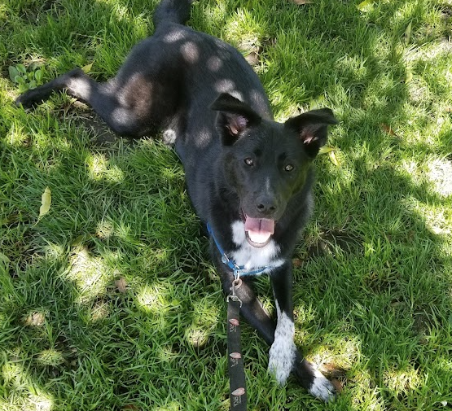

</img>

## Belief State Encoder / Decoder (Anymal) - Pytorch

Implementation of the Belief State Encoder / Decoder in the new <a href="https://leggedrobotics.github.io/rl-perceptiveloco/">breakthrough robotics paper</a> from ETH Zürich.

This paper is important as it seems their learned approach produced a policy that rivals Boston Dynamic's handcrafted algorithms (quadrapedal Spot).

The results speak for itself in their <a href="https://www.youtube.com/watch?v=zXbb6KQ0xV8">video demonstration</a>

## Install

```bash
$ pip install anymal-belief-state-encoder-decoder-pytorch
```

## Usage

Teacher

```python
import torch
from anymal_belief_state_encoder_decoder_pytorch import Teacher

teacher = Teacher(
    num_actions = 10,
    num_legs = 4,
    extero_dim = 52,
    proprio_dim = 133,
    privileged_dim = 50
)

proprio = torch.randn(1, 133)
extero = torch.randn(1, 4, 52)
privileged = torch.randn(1, 50)

action_logits, values = teacher(proprio, extero, privileged, return_values = True) # (1, 10)
```

Student

```python
import torch
from anymal_belief_state_encoder_decoder_pytorch import Student

student = Student(
    num_actions = 10,
    num_legs = 4,
    extero_dim = 52,
    proprio_dim = 133,
    gru_num_layers = 2,
    gru_hidden_size = 50
)

proprio = torch.randn(1, 133)
extero = torch.randn(1, 4, 52)

action_logits, hiddens = student(proprio, extero) # (1, 10), (2, 1, 50)
action_logits, hiddens = student(proprio, extero, hiddens) # (1, 10), (2, 1, 50)
action_logits, hiddens = student(proprio, extero, hiddens) # (1, 10), (2, 1, 50)

# hiddens are in the shape (num gru layers, batch size, gru hidden dimension)
# train with truncated bptt
```

Full Anymal (which contains both Teacher and Student)

```python
import torch
from anymal_belief_state_encoder_decoder_pytorch import Anymal

anymal = Anymal(
    num_actions = 10,
    num_legs = 4,
    extero_dim = 52,
    proprio_dim = 133,
    privileged_dim = 50,
    recon_loss_weight = 0.5
)

# mock data

proprio = torch.randn(1, 133)
extero = torch.randn(1, 4, 52)
privileged = torch.randn(1, 50)

# first train teacher (todo: still need to add full PPO training loop)

teacher_action_logits = anymal.forward_teacher(proprio, extero, privileged)

# teacher is trained with privileged information in simulation with domain randomization

# after teacher has satisfactory performance, init the student with the teacher weights, excluding the privilege information encoder from the teacher (which student does not have)

anymal.init_student_with_teacher()

# then train the student on the proprioception and noised exteroception, forcing it to reconstruct the privileged information that the teacher had access to (as well as learning to denoise the exterception) - there is also a behavior loss between the policy logits of the teacher with those of the student

loss, hiddens = anymal(proprio, extero, privileged)
loss.backward()

# finally, you can deploy the student to the real world, zero-shot

anymal.eval()
dist, hiddens = anymal.forward_student(proprio, extero, return_action_categorical_dist = True)
action = dist.sample()
```

PPO training of the Teacher (using a mock environment, this needs to be substituted with a environment wrapper around simulator)

```python
import torch
from anymal_belief_state_encoder_decoder_pytorch import Anymal, PPO
from anymal_belief_state_encoder_decoder_pytorch.ppo import MockEnv

anymal = Anymal(
    num_actions = 10,
    num_legs = 4,
    extero_dim = 52,
    proprio_dim = 133,
    privileged_dim = 50,
    recon_loss_weight = 0.5
)

mock_env = MockEnv(
    proprio_dim = 133,
    extero_dim = 52,
    privileged_dim = 50
)

ppo = PPO(
    env = mock_env,
    anymal = anymal,
    epochs = 10,
    lr = 3e-4,
    eps_clip = 0.2,
    beta_s = 0.01,
    value_clip = 0.4,
    max_timesteps = 10000,
    update_timesteps = 5000,
)

# train for 10 episodes

for _ in range(10):
    ppo()

# save the weights of the teacher for student training

torch.save(anymal.state_dict(), './anymal-with-trained-teacher.pt')
```

To train the student

```python
import torch
from anymal_belief_state_encoder_decoder_pytorch import Anymal
from anymal_belief_state_encoder_decoder_pytorch.trainer import StudentTrainer
from anymal_belief_state_encoder_decoder_pytorch.ppo import MockEnv

anymal = Anymal(
    num_actions = 10,
    num_legs = 4,
    extero_dim = 52,
    proprio_dim = 133,
    privileged_dim = 50,
    recon_loss_weight = 0.5
)

# first init student with teacher weights, at the very beginning
# if not resuming training

mock_env = MockEnv(
    proprio_dim = 133,
    extero_dim = 52,
    privileged_dim = 50
)

trainer = StudentTrainer(
    anymal = anymal,
    env = mock_env
)

# for 100 episodes

for _ in range(100):
    trainer()

```

... You've beaten Boston Dynamics and its team of highly paid control engineers!

But you probably haven't beaten a real quadripedal "anymal" just yet :)

</img>


## Todo

- [x] finish belief state decoder
- [x] wrapper class that instantiates both teacher and student, handle student forward pass with reconstruction loss + behavioral loss
- [x] handle noising of exteroception for student
- [x] add basic PPO logic for teacher
- [ ] add basic student training loop with mock environment
- [ ] add reward crafting as in paper
- [ ] play around with deepminds mujoco

## Diagrams

</img>

## Citations

```bibtex
@article{2022,
  title     = {Learning robust perceptive locomotion for quadrupedal robots in the wild},
  url       = {http://dx.doi.org/10.1126/scirobotics.abk2822},
  journal   = {Science Robotics},
  publisher = {American Association for the Advancement of Science (AAAS)},
  author    = {Miki, Takahiro and Lee, Joonho and Hwangbo, Jemin and Wellhausen, Lorenz and Koltun, Vladlen and Hutter, Marco},
  year      = {2022},
  month     = {Jan}
}
```
