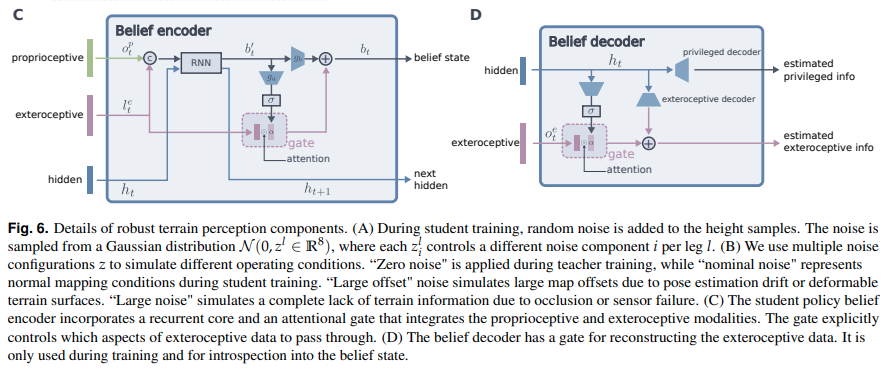
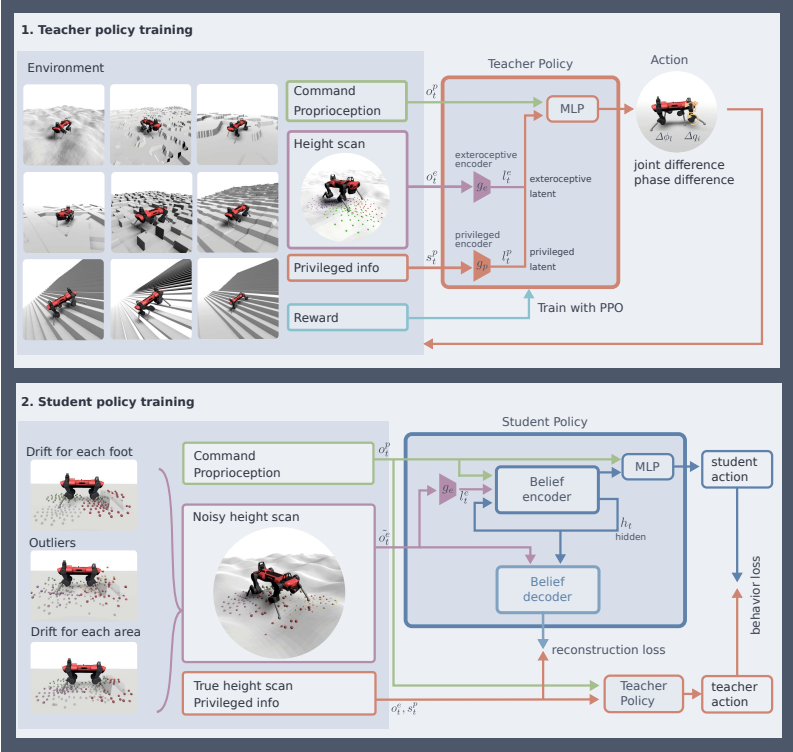

</img>

## Belief State Encoder / Decoder (Anymal) - Pytorch (wip)

Implementation of the Belief State Encoder / Decoder in the new <a href="https://leggedrobotics.github.io/rl-perceptiveloco/">breakthrough robotics paper</a> from ETH Zurich.

This paper is important as it seems their learned approach produced a policy that rivals Boston Dynamic's handcrafted algorithms (quadrapedal Spot).

The results speak for itself in their <a href="https://www.youtube.com/watch?v=zXbb6KQ0xV8">video demonstration</a>

## Install

```bash
$ pip install anymal-belief-state-encoder-decoder-pytorch
```

## Usage

Teacher

```python
import torch
from anymal_belief_state_encoder_decoder_pytorch import Teacher

teacher = Teacher(
    num_actions = 10,
    num_legs = 4,
    extero_dim = 52,
    proprio_dim = 133,
    privileged_dim = 50
)

proprio = torch.randn(1, 133)
extero = torch.randn(1, 4, 52)
privileged = torch.randn(1, 50)

action_logits = teacher(proprio, extero, privileged) # (1, 10)
```

Student

```python
import torch
from anymal_belief_state_encoder_decoder_pytorch import Student

student = Student(
    num_actions = 10,
    num_legs = 4,
    extero_dim = 52,
    proprio_dim = 133,
    gru_num_layers = 2,
    gru_hidden_size = 50
)

proprio = torch.randn(1, 133)
extero = torch.randn(1, 4, 52)

action_logits, hiddens = student(proprio, extero) # (1, 10), [(1, 50), (1, 50)]
action_logits, hiddens = student(proprio, extero, hiddens) # (1, 10), [(1, 50), (1, 50)]
action_logits, hiddens = student(proprio, extero, hiddens) # (1, 10), [(1, 50), (1, 50)]

# train with truncated bptt
```

Full Anymal (which contains both Teacher and Student)

```python
import torch
from anymal_belief_state_encoder_decoder_pytorch import Anymal

anymal = Anymal(
    num_actions = 10,
    num_legs = 4,
    extero_dim = 52,
    proprio_dim = 133
)

# mock data

proprio = torch.randn(1, 133)
extero = torch.randn(1, 4, 52)
privileged = torch.randn(1, 50)

# first train teacher (todo: still need to add full PPO and rewards)

teacher_action_logits = anymal.forward_teacher(proprio, extero, privileged)

# ... do PPO things and train teacher based of its actions in simulation with domain randomization

# then, after teacher is satisfactory, init the student with the teacher weights, whichever networks are the same

anymal.init_student_with_teacher()

# finally, feed the proprioception, exteroception, and privileged info to the anymal forward method to obtain the reconstruction and behavior loss

# train this with truncated bptt with truncation step of 10

loss, hiddens = anymal(proprio, extero, privileged)
loss.backward()
```

... You've beaten Boston Dynamics and its team of highly paid control engineers!

## Todo

- [x] finish belief state decoder
- [x] wrapper class that instantiates both teacher and student, handle student forward pass with reconstruction loss + behavioral loss
- [x] handle noising of exteroception for student
- [ ] add basic PPO logic for teacher + reward crafting

## Diagrams

</img>

## Citations

```bibtex
@article{2022,
  title   = {Learning robust perceptive locomotion for quadrupedal robots in the wild},
  volume  = {7},
  ISSN    = {2470-9476},
  url     = {http://dx.doi.org/10.1126/scirobotics.abk2822},
  DOI     = {10.1126/scirobotics.abk2822},
  number  = {62},
  journal = {Science Robotics},
  publisher = {American Association for the Advancement of Science (AAAS)},
  author  = {Miki, Takahiro and Lee, Joonho and Hwangbo, Jemin and Wellhausen, Lorenz and Koltun, Vladlen and Hutter, Marco},
  year    = {2022},
  month   = {Jan}
}
```
